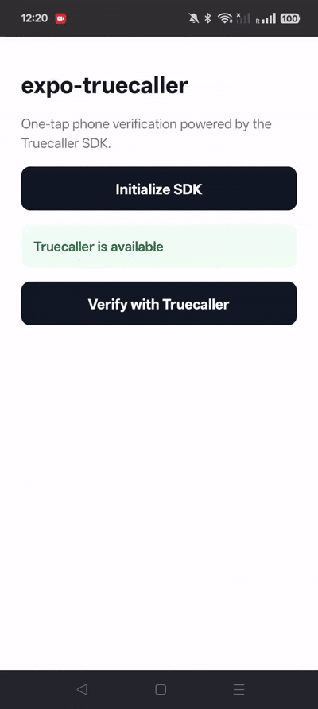

# expo-truecaller

[](https://www.npmjs.com/package/expo-truecaller)
[](https://github.com/shubh73/expo-truecaller/actions/workflows/ci.yml)
[](LICENSE)

One-tap phone verification powered by the [Truecaller SDK](https://docs.truecaller.com/). Android returns an OAuth authorization code for backend token exchange; iOS returns the user's Truecaller profile directly.



## Installation

```
npx expo install expo-truecaller
```

Add the config plugin to your `app.json` / `app.config.ts`:

```json
{
  "plugins": [
    [
      "expo-truecaller",
      {
        "androidClientId": "YOUR_ANDROID_CLIENT_ID",
        "iosAppKey": "YOUR_IOS_APP_KEY",
        "iosAppLink": "https://your-app-link.com"
      }
    ]
  ]
}
```

All fields are optional. Omit a platform's fields to skip its native setup.

> This module requires a [development build](https://docs.expo.dev/develop/development-builds/introduction/). It will not work in Expo Go.

## Usage

### Android

```typescript
import { initializeAsync, verifyUserAsync, TruecallerErrorCodes } from "expo-truecaller";

const { isUsable } = await initializeAsync({
  consentMode: "bottomsheet",
  heading: "logInTo",
  theme: "dark",
});

if (isUsable) {
  try {
    const { authorizationCode, codeVerifier } = await verifyUserAsync();
    // Exchange authorizationCode + codeVerifier on your backend
    // https://docs.truecaller.com/truecaller-sdk/android/oauth-sdk-3.0.0/server-side-response-validation
  } catch (e) {
    if (e.code === TruecallerErrorCodes.USER_CANCELLED) {
      // User cancelled — fall back to OTP
    }
  }
}
```

### iOS

```typescript
import { initializeAsync, requestProfileAsync } from "expo-truecaller";

const { isUsable } = await initializeAsync();

if (isUsable) {
  const profile = await requestProfileAsync();
  console.log(profile.firstName, profile.phoneNumber);
}
```

## API

### `initializeAsync(options?)`

Initialize the Truecaller SDK. Returns `{ initialized, isUsable }`. On Android, accepts optional [customization options](https://docs.truecaller.com/truecaller-sdk/android/oauth-sdk-3.2.1/integration-steps/customisation). On iOS, reads credentials from `Info.plist` (set by the config plugin). Some options (`loginTextPrefix`, `dismissOption`, extra `ctaTextPrefix` values) are available in the SDK binary but not yet in the official Truecaller docs.

### `verifyUserAsync(options?)` — Android

Trigger the Truecaller OAuth flow. Returns `{ authorizationCode, codeVerifier, scopesGranted, state }`. Options: `scopes` (defaults to `["profile", "phone"]`).

### `requestProfileAsync()` — iOS

Request the user's Truecaller profile. Returns `{ firstName, lastName, phoneNumber, countryCode, email, gender, avatarUrl, city, isVerified }`.

### `clear()`

Clear the SDK instance. Rejects any pending promise with `ERR_CLEARED`.

### Error codes

| Code | Meaning |
|------|---------|
| `ERR_USER_CANCELLED` | User dismissed the consent screen |
| `ERR_USER_PRESSED_BACK` | User pressed the footer button (Android) |
| `ERR_USER_DISMISSED` | User dismissed while loading (Android) |
| `ERR_NOT_INSTALLED` | Truecaller is not installed |
| `ERR_NOT_AVAILABLE` | OAuth flow is not usable |
| `ERR_NOT_INITIALIZED` | `initializeAsync()` was not called |
| `ERR_ALREADY_IN_PROGRESS` | A request is already pending |
| `ERR_CLEARED` | `clear()` was called while pending |
| `ERR_SDK_ERROR` | Internal SDK error |
| `ERR_SDK_TOO_OLD` | SDK or device not compatible |
| `ERR_MISSING_CLIENT_ID` | Invalid partner credentials (Android) |
| `ERR_VERIFICATION_REQUIRED` | Additional verification required (Android) |
| `ERR_IOS_UNIVERSAL_LINK_FAILED` | Universal Link resolution failed (iOS) |
| `ERR_IOS_URL_SCHEME_MISSING` | URL scheme not configured (iOS) |
